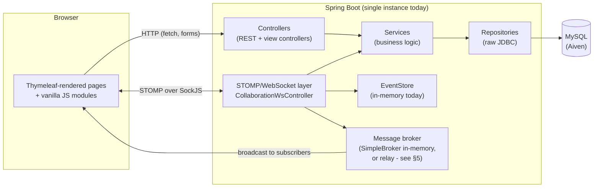

# Architecture

This document explains how CollaboDraw is put together, why it's put together that way, and
what has to change for it to run on more than one server instance. It complements
[PROJECT_STRUCTURE.md](PROJECT_STRUCTURE.md) (which tells you *where* a file lives) with the
*why* behind the structure.

## 1. What this is

A real-time collaborative whiteboard: multiple users draw on the same board and see each
other's strokes, cursors, and presence live. Server-rendered pages (Thymeleaf) rather than a
JS single-page app; real-time sync over STOMP-over-WebSocket; MySQL for persistence via raw
JDBC repositories (no JPA/Spring Data, aside from the OAuth2 client registration machinery
Spring Security itself uses).

## 2. Component overview

## 3. Request flow, two ways

**A page load** (`GET /home`, `GET /mainscreen`, ...): `Controller` calls a `Service`, the
service calls a `Repository` (plain JDBC `SELECT`s, mapped by hand to entities), the
controller puts the result on the `Model`, Thymeleaf renders the template server-side, HTML
goes back over HTTP. `GlobalModelAttributes` (a `@ControllerAdvice`) injects a few
cross-cutting values - like the user's saved theme - into *every* render without each
controller repeating that lookup.

**A drawing stroke**: the browser publishes to `/app/...` over the STOMP connection ->
`CollaborationWsController` checks the sender is actually a member of that board (via
`WebSocketAuthorizationInterceptor` at SUBSCRIBE time, and membership checks again in the
handler - see below) -> the event is appended to that board's `EventStore` so a late joiner
can replay history -> the message broker fans it out to `/topic/board/{id}` -> every other
subscriber's browser draws it. No database write happens on every stroke; boards are
persisted as a snapshot (see `WhiteboardService`/`DrawingService`), not stroke-by-stroke.

## 4. Layering and where things live

Standard layered architecture: `controller` -> `service` -> `repository`, plus a few
cross-cutting packages:

- `config/` - Spring wiring: security filter chain composition lives in `security/`, but
  WebSocket transport config, the theme model-attribute injector, and CORS/static-resource
  config live here.
- `realtime/` - `EventStore` (interface) + `InMemoryEventStore` (the only implementation
  today). Pulled out of `service/` deliberately: this is the one piece of application state
  that *cannot* simply move to the database without changing its performance characteristics
  (it's replay history for an ephemeral live session, not a durable record), so it's the
  first thing that needs a different backing store when this app runs on more than one
  instance. Keeping it behind an interface means that's a new `@Service` bean, not a rewrite
  of `CollaborationWsController` and `LiveStateController` (its only two callers).
- `exception/` - `GlobalExceptionHandler` (`@ControllerAdvice`) is the single place that
  decides what an anonymous vs. authenticated caller is allowed to learn about a failure
  (never raw SQL/stack details to `/api/**`, since most of those routes are reached before
  Spring Security's authorization check runs).
- `security/` - filter chain, `UserDetailsService`, the `PreventLoginSwitchFilter` that stops
  a second login silently hijacking a session that's already authenticated as someone else.

## 5. The scaling story

**Where it stands today: one instance, full stop.** Three pieces of state live only in this
one JVM's memory, and none of them are visible to a second instance:

| State | Lives in | What breaks with 2 instances |
|---|---|---|
| STOMP broker (who's subscribed to what) | `SimpleBrokerMessageHandler` | User A on instance 1 and User B on instance 2, both on the same board, never see each other's strokes - the broker only knows about its own instance's subscribers. |
| Live event replay history | `InMemoryEventStore` | A late joiner routed to instance 2 replays *instance 2's* event history for that board, which is empty if all the drawing happened on instance 1. |
| HTTP session (login state) | Servlet container's default in-memory session store | A request that lands on instance 2 after login happened on instance 1 looks logged out, unless the load balancer pins a user to one instance for their whole session (sticky sessions) - which caps you at "instances as failover," not "instances as more capacity." |

**What's already in place to fix it, without more code:**

- `EventStore` is an interface now (`com.example.collabodraw.realtime`). A
  `RedisEventStore implements EventStore` (or a DB-table-backed one, if replay durability
  matters more than speed) is a new class + making it the bean Spring wires in - callers
  don't change.
- `WebSocketConfig` reads `app.stomp.relay.enabled`. Set it (plus host/port/credentials) and
  the broker becomes a real relay to RabbitMQ (STOMP plugin) or ActiveMQ instead of
  `SimpleBroker` - every instance connects to the same external broker, so subscribers on
  different instances see each other. This is a deploy-time property change today, not
  hypothetical.

**What's still a real gap, deliberately not half-solved here:** the HTTP session problem
needs either `spring-session-jdbc` (session table in the existing MySQL database - simplest,
reuses infra you already pay for) or `spring-session-data-redis` (if Redis is already in the
picture for the event store, share it). Neither dependency is added yet: pulling in Spring
Session without a real Redis/shared-DB-session setup to test it against would be exactly the
kind of "looks done, isn't verified" change this project has been actively trying to avoid.
When you're ready to actually run two instances, this is the next concrete step, not before.

**Also still open**, tracked in the status page, not architectural:
near-zero automated test coverage, and OAuth2 client registrations being required at
startup even for a deployment that only wants password login.

## 6. Key decisions and why

- **Raw JDBC repositories instead of JPA/Spring Data.** Full control over the exact SQL
  running against a live, cost-metered Aiven MySQL instance, and no ORM-generated N+1 query
  surprises to debug under a real-time workload. Trade-off: more boilerplate per repository
  method, no automatic dirty-checking.
- **Server-rendered Thymeleaf instead of a JS framework.** Simpler deployment (one process,
  no separate frontend build/CDN), and most of this app's pages are exactly the kind of
  mostly-static-with-some-interactivity CRUD screens SSR is good at. The one page doing
  genuinely complex client state - `mainscreen.html`, the whiteboard editor - is
  correspondingly the one page with the most JS, split into `static/modules/*.js` by concern
  (drawing, history/undo, realtime sync, storage/autosave, UI chrome) rather than one file.
- **STOMP over raw WebSocket.** Gets pub/sub semantics (topic subscriptions, per-destination
  routing) and SockJS fallback for free instead of hand-rolling a message-routing protocol
  on top of raw WebSocket frames.
- **Session-based auth, not JWT.** Simpler revocation (a WebSocket auth interceptor gets to
  reuse the same Spring Security `Authentication` a page request uses at handshake time), at
  the cost of the session-affinity problem in §5.

## 7. If you're picking this up next

Read the status page (link from the project's Claude artifacts, or ask for it regenerated)
for the current fixed/open list before starting anything - it's kept more current than any
static doc can be. The three things most likely to matter next, in order of how much they'd
actually unlock: (1) an actual decision on 2FA - build it or remove the toggle, (2) a shared
session store, once there's a real reason to run two instances, (3) test coverage, especially
around the access-control logic in `CollaborationWsController` and `LiveStateController` -
those tests exist today (`CollaborationWsControllerAccessControlTest`) but are the exception,
not the norm.
